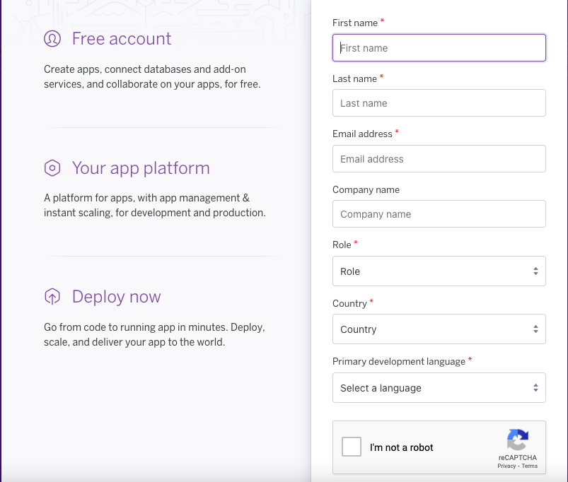
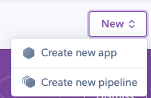

# SVERIGE LOPPIS

**Sverige Loppis: The Swedish Flea Market.**
OUR GOAL is to be the biggest platform for Swedish Flea Market/Sverige Loppis.
Sverige Loppis is hoping to be a platform for all the second hand sellers and buyers.


* Organize your Loppis day, add date, time, image of your loppis, add your address.
* Find many other loppisses around you by just a click of search and filter.
* Look for what is new. Search by County. Save other loppis announcements for later.
* Easily identify the loppises that are available or ended.
* To get immediately notified on any Loppis notification, subscribe to our newsletter.

*The Live Site can be found [here](https://sverigeloppis.herokuapp.com/).*

# UX
## Strategy
* The primary target audience for this E-commerce site is Swedish Flea Market: Loppis. Sweden has a culture for buying and selling second-hand items. 
* This platform will give users easy access to loppises around. Users can easily and safely announce their loppises.
* The target audience currently is located in Sweden. In future, other countries will be added on to Sverige Loppis.
* There is no age gap of my audience, anyone can announce their loppis to sell their second hand items, or anyone can visit the site to find loppises they wish to go.
* I designed this platform with desgin thinking approach. With only the necessary content/information. User can surf the site easily and get the information they are looking for.

## Scope & User Stories
Please find all my defined user stories [here](https://github.com/MerveKucukzoroglu/sverigeloppis/issues?q=is%3Aclosed+label%3AUSER-STORY)

### Member User:
* As a member user I want to be able to login or logout so that I can access my personal account information.
* As a user I want to be able to easily recover my password in case I forget it so that I can recover access to my account.
* As a user I want to be able to receive an email confirmation after registering so that I can verify that my account registration was successful.
* As a user I want to be able to have a personalised profile page so that I can manage my account, add/edit or delete loppises that I published.
* As a member user I want to be able to ask question to the loppis owner if I want to have more information regarding their loppis.

### Seller:
* As a seller I want to be able to add my own loppis announcement so that I can get buyers to come to my loppis and purchase.
* As a seller I want to be able to make payment with card so that I can my ad is successfully published in loppis list.
* As a seller I want to be able to see the amount of each announcement so that I can decide to proceed with payment or not.
* As a seller I want to be able to view my loppis information I entered just before payment so that I can make sure all the information I have entered are correct.
* As a seller I want to be able to adjust my loppis just before payment so that I can correct any mistakes before the payment.
* As a seller I want to be able to easily enter my payment information so that I can checkout smoothly.
* As a seller I want to be able to feel my personal and payment information is safe and secure so that I can confidently provide the information to make the payment.
* As a seller I want to be able to view a success page (payment and ad confirmation) so that I can verify that I haven't made any mistakes.
* As a seller I want to be able to receive an email confirmation after checkout so that I can keep the confirmation of my payment and to keep a record of it if I want.
* As a seller I want to be able to edit any loppis announcement I have added so that I can update/add or change any important information.
* As a seller I want to be able to delete any loppis announcement I have added so that I can be in control of my items posted.

### General Site visitor:
* As a site user I want to be able to view all loppis announcments so that I can save and consider going to loppis.
* As a site user I want to be able to find the menu easily so that I can know what content is available on the site.
* As a user I want to be able to easily register an account so that I can I can create and add my own loppis announcements.
* As a site user I want to be able to view the loppis details so that I can make an informed decision for my needs.
* As a site user I want to be able to navigate through the site so that I can view the desired content.
* As a user I want to be able to filter loppis by County so that I can find the ones that are closer to me.
As a user I want to be able to see the loppis date and time so that I can go to the flea markets(loppises) that are available during open hours.
* As a user I want to be able to save the announcements so that I can view the details later.
* As a user I want to be able to see the availability status of loppis so that I can know if it is expired.
* As a user I want to be able to search by title, description or county so that I can I can find easily to the one I want to go.
* As a user I want to be able to subscribe to newsletter so that I am informed about any loppises or announcements made.

### Admin
* As an admin I want to be able to have a support email so that I can I can be in control of any kind of support needed.
* As an admin I want to be able to in control of django admin panel so that I can I can take necessary actions for any misconduct or issue reported.

## Structure
This E-Commerce site is built giving the control of the user experience to the users. 
* If the user is just site visitor, they can: 
    * Find list of loppises, 
    * Loppis details,
    * Add loppis to their wishlist,
    * Subscribe to our newsletter,
    * Join and follow our Facebook page,
    * Surf the site and use search functionality,
    * Find information in 'About Page' on how Sverige Loppis works,
    * Access to register and create account
* If the user is a registered member user, in addition to a regular site visitor features, they can:
    * Have a personalized account,
    * Create and make a safe payment to publish Loppis Ad,
    * List of loppises they own within their profile page,
    * Ability to manage (edit or delete) the loppises they own,
    * Ask question to loppis owner,

*Throughout the project development, GitHub projects is used. Click [here](https://github.com/MerveKucukzoroglu/sverigeloppis/projects/1) to view the process.*

### Wireframes
Wireframes are the initial sketches of the application, but not the last. Over the coding process, the design and features have been upgraded and developed further to enhance user experience. Wireframes have been designed using [Balsamiq Wireframes](https://balsamiq.com/).

<details>
<summary>Each pages wireframes includes mobile(small screen), tablet(medium screen), desktop(large screens).</summary>

<details>
<summary>Home page:</summary>


</details>

<details>
<summary>About page:</summary>


</details>

<details>
<summary>Loppis page:</summary>


</details>

<details>
<summary>Loppis details page:</summary>


</details>

<details>
<summary>Login page:</summary>


</details>

<details>
<summary>Register page:</summary>


</details>

<details>
<summary>Profile page:</summary>


</details>

<details>
<summary>Add Loppis page:</summary>


</details>

<details>
<summary>Edit Loppis page:</summary>


</details>

<details>
<summary>Manage Loppis page:</summary>


</details>

<details>
<summary>Checkout page:</summary>


</details>

<details>
<summary>Success page:</summary>


</details>

</details>
<br>

### Databases
Database below is the overall schema of the models used in this project. I have used [Lucidchart](https://lucid.app/documents#/dashboard) to generate the diagram below.


**CUSTOM MODELS**

Within this application, I have used Django User Model and created my own Custom Models for this project. Below are the details of custom models:

1. Loppis Model:
    * Loppis Model is the main model for this application. 
    * Main functionalities to create, publish, manage loppis are connected to Loppis Model.
    * This model contains 'seller' which is ForeinKey of user from django user mdoel.
    * 'title' is the name of Loppis, created by user while adding the loppis. User can edit the title later if they want to.
    * Loppis page is sequenced by the new posts at top and old posts later. To generate this, I used 'created_on' DateTimeField which is auto generated in the backend at the time loppis ad is created by user.
    * 'start_date' and 'end_date' are the DateFields that holds the loppis events' dates. These fields are uneditable, therefore users are asked to carefully decide between which dates they will have loppis. The reason for not allowing user to edit these fields are for them to create new announcement for each loppis they organize. This two field have django calender widget. Start date and end date are also linked and controlled by javascript function so that end date is always on or after start date.
    * 'start_time' and 'end_time' are the open timings of loppis. These fields can be edited later based on the sellers availability and requirements. Both these fields are generated with django timer widget.
    * 'country' field is auto-filled and forced as "Sweden" as my initial target audience is based in Sweden. However in the future, it will be upgraded and country field will be open for any other country.
    * 'postcode' field is optional.
    * 'county' field is an important field for my initial audience in Sweden. County is a Foreign Key from County Model. 
    * 'city' and 'street_address' fields are required fields for identifying location of loppises. This helps users to find available loppises close to them.
    * 'phone_number' is an optional field. If the seller wants to provide their phone phone number to their loppis visitors/customers for easy reach, they can do so.
    * 'image' and 'image_url' fields are for adding images of their loppis, so that loppis owners can personalise their advertisement. It is optional, there is a default image provided if this field is left empty. 
    * 'description' is an optional field for adding details of loppis advertisements.

2. County Model:
    * County Model has been created for localizing Swedish Loppises. I have noticed that specifying county is one of the essential part of loppis announcements in Sweden. 
    * In this Model I had to divide list of county in two fields.
    * 'county' field is the name of county.
    * County means 'län' in Sweden. While mentioning counties, it is used by word 'län'. For example, Stockholms län. 'Stockholm' is the name of county and 'län' is the word used for county. 
    * Some of the counties change name adding the letter 's' to the end when used with 'län', e.g, Jönköpings län. However in some cases there is no additional letter to the county name, such as Örebro län. Considering this change in names, I have added another field 'friendly_name' for creating a list of counties same as how Swedish locals use.

3. Question Model:
    * This models gives users the ability to ask questions about loppis to the owner directly. 
    * For getting access to this feature, and ask a question, users are supposed to be signed in and have a registered account in the site. Even if the site visitors are not registered or signed in, they can read the questions asked within the loppis details page.
    * This feature is available inside each loppis details page.
    * 'loppis' field is foreign key from Loppis Model. This connects the Question asked to that particular Loppis.
    * 'author' is the person asking the question to the seller.
    * 'email' is collected from django user model for recording purposes. 
    * 'content' is the field for user to fill in and to type their question. This field holds the content of question.
    * 'created_on' is the DateTimeField for arranging the sequence of questions and help seller to identify when that particular question was asked.  

4. Subscription (Newsletter) Model:
    * Subscription is for subscribing our site newsletter. Any site visitor can subscribe to the newsletter, they do not have to register to the site for subscribing to our newsletter.
    * Subscription model has two fields: 'email' and 'subscribed_on'.
    * Anyone can subscribe by their 'email'. Once subscribed, the subscribers will get a thank you email for subscribing to our newsletter.
    * 'subscribed_on' field is auto generated DateTimeField for recording the day and time of subscriptions.
    * The same email cannot be used to subscribe twice. The user will be notified by alert message that email is already in listed for our newsletter

5. Advert Model:
    * This model has 3 fields. While creating a loppis advertisement, advert model generates the 'ad_number', 'stripe_pid' and 'ad_payment_date'.


# UI
## Color Palette:

* Color palette is chosen with keeping in mind the target audience. As Sverige Loppis' main target is Sweden, Blue and Yellow was my first choice.
* Blue color has a psychological effect on trust, offical, calm; and yellow color psychologically gives a charming, friendly effect.
* To maintain the color contrast I chose to use a softer tones of blue and yellow. 
* I have used [Coolors](https://coolors.co/) to generate my color palette.

## Fonts
* To maintain simple UI, font chosen was Montserrat from [Google Fonts](https://fonts.google.com/specimen/Montserrat?query=mont#standard-styles).

# Marketing
## Plan:
Sverige Loppis website is a business to customer (B2C) E-Commerce platform, built and designed to advertise and sell second hand events (loppises) to the users & inform site visitors about loppises announced. 

Before beginning this project I designed a marketing plan which can be found here:
[Marketing PDF](/documentation/documents/marketing.pdf)

### Facebook
For reaching out to my initial target audience in Sweden, I have created a Facebook Business Page. The reason I chose Facebook as my marketing strategy is because my target audience currently uses Facebook Marketplace to announce their loppises. However it does not have features that a loppis seller or buyer would like to see. Capturing this feature gap, I have created Sverige Loppis platform to provide this service to the users. Therefore Facebook Business Page will help me grow my audience faster.

The facebook Page link can be found in the footer of the site and in the content of about page.
You can find our Facebook page [here](https://www.facebook.com/Sverige-Loppis-105393595519638).


### Newsletter
Any site visitor could subscribe to our newsletter. Subscribers will receive emails regarding new features, discounts and get access to many more benefits from Sverige Loppis Business.

The newsletter subscription could be found at footer of site, and in 'About' page.


Subscribers will receive an email after they signup:


## SEO's
* Keyword Documentation:
    1. Loppis
    2. Loppis near me
    3. Find loppis
    4. Add loppis
    5. Second Hand
    6. Flea Market
    7. Loppis Online
    8. Loppis idag
    9. Loppis (county location) 

* The project includes robots.txt file in the root directory
* The project includes sitemap.xml file in the root directory generated using [XML Sitemaps](https://www.xml-sitemaps.com/)
* Privacy Policy is attached to the footer. It is generated using [Privacy Policy Generator](https://www.privacypolicygenerator.info/).

# Features:
## Navbar:
Fixed navbar at top of the page. Users can easily navigate through the site.


Navbar is styled to be responsive and collapsible for smaller screens.

 


## Footer
Footer is also fixed to the bottom of the page. Footer has link for newsletter subscription, social media - Facebook page link, contact button for sending email to the site owner.


The footer is fully responsive for all screen sizes and can smoothly adjust style for screen size.


## Home Page
Home page is designed to maintain simplicity. Less and direct information is provided for the site visitor when they first land on the page. There is a background image and two buttons for the primary actions of this E-commerce site. One button is to add a Loppis Advertisement, and the other one is to find all the loppises published. The background image is choosen to give an idea of Loppis/Flea Market. The credits for this background image is provided in the [credits](#credits) section.


## About Page
About Page defines the business goal, points out important main features and what differenciates this application than other other similar businesses. Steps to add loppis, and cost information can also be found in this page. Lastly, there is a section that informs about the Sverige Loppis Facebook Page and invites users to follow and join our Facebook Community Group.


## Loppis Page
* Loppis page has all the announced loppises sequenced from new ones at top and old ones later. Once a seller successfully makes their payment and publishes their loppis, it will immediately appear in this page. 

* Each loppis is in the form of cards that has image, title, availability status, county, date, time and a button to view more details. 

* At the top of this page, there is a [county list selector](#county-list-selecter) and the number of loppises published. 

* For increasing the user experience, there is a sticky button at right bottom of the page that takes the user to the top of the page. 

    

* Loppis page is fully responsive for all screen sizes. 

    

## Loppis Availability Function
Loppises are generally announced a few weeks or days ahead and lasts only for a few days long. Some seller might choose to announce their loppis weeks before while others might announce few days before. Therefore, user need to know and easily identify which loppises are still available and which are ended.

* Status tags in all Loppis page:

      

* These tags are also found within each loppis details page:

     

* Available loppises can be added to wishlist while loppises that are past can't be added to the wishlist. 

## Search Function
* Find many other loppisses around you by just a click of search and filter. Users can find what they want by searching about it in the search field. The location, kind of item available in loppis, or title; these are search query content generated by information in 'title', 'description' and 'county'.
* Once the search result is generated, the number of items found based on their search, and a button to go back to all loppis page is provided.

* For each search requested, loppises found will be listed:

    

* If the word searched does not match anything:  

    

## County list selecter

* I have noticed that specifying county is one of the essential part of loppis announcements in Sweden. Users usually search loppises located in their county or the ones closer to them. 
* For that reason, there is a filter list on the loppises page for filtering the county they want to search for loppis announcements. 

    

* Once selected, the result for county search will be filtered and only the announcements in that area will be listed. Such as, if Stockholms län is selected, then only the loppises in Stockholm will be listed on the page.

    

## County Tags
* Loppises can also be filtered and searched by the county tags within each loppis by clicking to the county names.
* In the images below, I have outlined the county tag in yellow color for documentation purposes.

    

    

## Loppis Details Page
* Each loppis announcement have a detail page. This page contains more details about that particular loppis and additional information such as name of seller, further location details, enlarged loppis-image, add to wishlist button, availability status tag, go back button and [asking question functionality](#asking-a-question-to-loppis-owner-function).

    

* If the loppis period ended for that particular announcement, 'add to wishlist' button will not be displayed. This button will also not be displayed for that loppis announcement owner. 

* In order to ask question to the seller/loppis owner, the user must be registered and signed in.

* The loppis details page will have options for owner/seller to edit or delete. This will be provided if the authenticated user is the seller of the loppis. Only the seller can view this option for their own loppises. 

    

## Loppis Wishlist Page
* Any site visitor can add anouncements they like to their wishlist. The add to wishlist functionality is in loppis details page. 
* The user do not have to be registered or signed in to use this feature. 
* This part of the site uses session storage to save the data and actions of user. 
* User can remove any loppis they have added to their wishlist page if they want to.
* Wishlist will help users to list all the loppises that they would like to go. Users can use this page to differentiate, identify and select the one that is best for their requirements.
* The available status will be displayed untill the last minute of the day, but considering that the time of loppis might be ended, users will not be able to add that particular loppis to their wishlist. In the future, the availability status of loppis will be automated to last days' end time entry by user. And this can be updated automatically if the seller changes the timings.

    

* Empty wishlist:

    

## Personalised Account Page
Every registered users will have a profile page. In order to access your profile page, you must be registered and signed in. This page has a button for managing their loppises (if published), a button to add a loppis, and another one for their wishlist. 


## Sell/Advertise Function
As an E-commerce application, this is the core functionality that enables business to run. Any loppis created, announced goes through a payment process and it is handled within this page.


 The breakdown of features on this page is as follows:

* Introduction:
    *  Before they add a loppis or make any payment, a set of information is provided to them. 
    * It is noted that amount cost is '5 SEK' and there will be a secure payment system. 
    * Additionally, there is a link provided to the 'about' page that explains the steps and what to expect from their payment and advertisement. 
    * The seller could also see their registered user name to be the seller of the loppis that they will create. 

        

* Title:
    * This is a required field. Title is the name of loppis. Seller can later edit this field.

        

* Start Date and End Date: 
    * Sellers are asked to choose their start and ending dates of their loppis carefully. These fields are uneditable, therefore users are asked to carefully decide between which dates they will have loppis. The reason for not allowing user to edit these fields are for them to create new announcement for each loppis they organize. 

        
    
    * This two field have django calender widget.

        Date Desktop view:

        

        Date Mobile Day view:

        

        Date Mobile Night View:

        

    * Start date and end date are also linked and controlled by javascript function so that end date is always on or after start date. Days before current day will be disabled and cannot be selected. Once the seller selects a start date, the end date widget will automatically disable the days before the chosen start date.

* Start and End Time:
    * These are the open timings of loppis. It can be edited later based on the sellers availability and requirements. Both these fields are generated with django timer widget.

        Time Widget Desktop View:

        

        Time Mobile Day view:

        

        Time Mobile Night View:

        

* Address:
    * It is required for your Loppis location. You can choose to enter only the required fields. 
    * Country field is auto-filled and forced as "Sweden" as my initial target audience is based in Sweden. However in the future, it will be upgraded and country field will be open for any other country.
    * Postcode field is optional.
    * County field is an important field for my initial audience in Sweden. Specifying county is one of the essential part of loppis announcements in Sweden. 
    * City and Street address fields are required fields for identifying location of loppises. This helps users to find available loppises close to them.
    * Phone number is an optional field. If the seller wants to provide their phone phone number to their loppis visitors/customers for easy reach, they can do so.
        
        

    * Image is for adding images of their loppis, so that loppis owners can personalise their advertisement. It is optional, there is a default image provided if this field is left empty. Seller can edit or remove their image if they want to.
    * Description is an optional field for adding details of loppis advertisements.

        

    * **PAYMENT**:
        * Payment field is generated using [stripe payment system](https://stripe.com/en-se) API.
        * It is a safe and secure payment system. Stripe does validation and authenticates the card owner for completing the payment process.
        * Users are notified how much their card will be charged when they click payment button. They can also cancel adding a loppis anytime before clicking complete payment button.

            

        * Currently you can make payments with test card number "4242 4242 4242 4242", MM/YY - 04/24, CVC - 242, ZIP - 42424

            

        * While the transaction is in progress, a loader is displayed letting user to wait and know that transaction is in progress.

            

        * Stripe has its own error handling function, if a card is not valid, or incorrect for some reason, it will throw error letting user know what the issue is.

            

## Success Page
Once a payment is successfull, user/seller will be on success page, informing about their successfull payment with a thank you message.


## Confirmation Email
Sellers recieve confirmation email each time they create a loppis add and make a successfull payment.


## Manage My Loppis Page
Sellers can manage their loppises as they wish. This page can be found from their profile page, "My Loppises" button. They need to be the owner of the loppis to have them listed in their manage page. This page will look similar to all loppises page, but only the ones that are owned by them will be listed in the page.


## Edit Loppis
The sellers have the ability to edit their own loppis announcements. They can find the edit button within the loppis details. Only the owners can see the edit button. It can also be found from My Profile > My Loppises and choose any loppis they would like to view/manage and edit.

* Start Date, End Date and country fields are displayed but locked and can not be edited. This is informed to the user at the stage of adding and payment as well.
* All the other fields are editable and all the required fields must be filled in for updating their loppis.
* Please note that editing loppis is not creating a new loppis, therefore it is completely free of charge. 
* The updated loppis will immediately publish in all-loppises page and be updated accordingly.

    

    

## Delete Loppis
The sellers have the ability to delete their own loppis announcements. They can find the delete button within the loppis details. Only the owners can see the delete button. It can also be found from My Profile > My Loppises and choose any loppis they would like to view/manage and delete.

* Once they want to delete a loppis, a confirmation modal is displayed asking the seller for confirmation and informing that they will not be refunded their 5 SEK payment back.

    

* After confirming the deleting the selected loppis, this action cannot be undone.

## Asking a question to Loppis owner Function
Users can ask questions about loppis to the owner directly. For getting access to this feature, and ask a question, users are supposed to be signed in and have a registered account in the site. Even if the site visitors are not registered or signed in, they can read the questions asked within the loppis details page. This feature is available inside each loppis details page.


If the user is registered and signed in:


## Notification System
Throughout the site there is a notification system installed. Bootstraps 'toast' feature is utilized and modified based on sites requirements.

* There are: Error(red), Info(blue), Success(green) and Warning(yellow) messages with each separated by color codes. 
* The notifications appear on top right corner. It must be closed by user to disappear.
    
    Success Notification:

    

    Alert/Info Notification:

    

    Error Notification:

    

## Newsletter Subscription
Subscription is for subscribing to our site newsletter. Any site visitor can subscribe to the newsletter, they do not have to register to the site for subscribing to our newsletter.


Subscription page can be found from navigated from 'About' page and a subscription button at footer at all times.


If the email already exists in newsletter subscription, then, an error message will be provided to the user.


Once subscribed, the subscribers will get a successfull  notification.


Successfully subscribed users will receive a thank you email for subscribing to our newsletter.


# Future Features
* I have bought a domain "sverigeloppis.se" for this site from [GoDaddy](https://se.godaddy.com/). In near future, I will implement this domain to my E-commerce site and use this business for real.
* Google Map API connection. This can open the address as pin in google map so that users can view the exact location.
* site users/buyers can send a request for more images or videos of loppis so that they can have a better view of the products they sell at loppis.
* The sellers can upload multiple images and can remove/add more whenever they want.
* Google translate API for multiple languages. 
* I will further develop Sverige Loppis and publish it in Appstore and Playstore as a mobile application for Android and IOS.

# Technologies Used
There are multiple technologies used for this E-Commerce site. Technologies used includes Front-end, Back-end, APIs, payment system and Fullstack toolkit: 

* HTML - Used for creating base templates.
* CSS - Style of the site.
* JavaScript - For dynamic functionalities and for connecting APIs.
* Python - Core programming language of this project.
* [Django](https://www.djangoproject.com/) - Django frameworks for templates tags, django models, django allauth.
* [Bootstrap](https://getbootstrap.com/) - Used for responsive design, models and noticifation (toast) setup.
* [Stripe](https://stripe.com/en-gb-se) - Core functionality for making payments possible.
* [Heroku](https://dashboard.heroku.com/apps) - To deploy the site
* [Github](https://github.com/) - Storing the repository, Kanban Github projects for project organising and management.
* [Gitpod](https://www.gitpod.io/) - Used as coding workspace.
* [Google Fonts](https://fonts.google.com/) - Font used in the site is Montserrat.
* [Font Awesome](https://fontawesome.com/) - The icons used in the site.
* [Lucidcharts](https://lucid.app/documents#/dashboard) - To create the chart of models.
* [Coolors](https://coolors.co/) - To generate and create the color palette of the site.
* [AmIResponsive](http://ami.responsivedesign.is/) - To generate the mockup image of the site with different devices.
* Google Developer Tools - To fix issues and test the responsiveness of the site.
* Balsamiq Wireframes - To design the wireframe of the complete project.
* [PEP8](http://pep8online.com/) - To check pyhton code validity.
* [W3C Markup Validation Service](https://validator.w3.org/) - For HTML Validator testing.
* [W3C CSS Validation Service](https://jigsaw.w3.org/css-validator/#validate_by_input) - For CSS Validation testing.
* [JSHint](https://jshint.com/) - Used for JavaScript validator testing.
* [SQLite](https://www.sqlite.org/index.html) - To store local database while creating the project.
* [PostgreSQL](https://www.postgresql.org/) - PostgreSQL from Heroku to store the deployed sites database.
* [Amazon Web Services (AWS)](https://aws.amazon.com/) - To store media and static files

# Testing
*Validator Testing*, *User Stories Testing* and *Bugs* are documented [here](/TESTING.md).

# Deployment:
This project was deployed to Heroku. "Heroku is a cloud platform that lets companies build, deliver, monitor and scale apps."- [Heroku.](https://www.heroku.com/)

<details>
<summary>Steps to open account in Heroku:</summary>
<br>
<ul>
    <li>
        <a href="https://signup.heroku.com/">Signup here </a>if you do not have an account already.
        
    </li>
    <li>
        After you fill in all the information for account and sign in, you will be on <a href="https://dashboard.heroku.com/apps">Dashbord.</a> Here is where you will create an application.
    </li>
    <li>
        <p>Click on New => Create new app.</p>
        
    </li>
    <li>Choose a name to your application and select location that you are based.</li>
</ul>
</details>

<br>

<details>
<summary>Steps to open an account in Stripe:</summary>

1. Go to [Stripe](https://stripe.com/en-gb-se) and click 'start now'.
2. Fill in your information

    
    
3. Click 'Create your Stripe Account'
4. You will receive a confirmation email. Go to your email, click the link for confirming your email address, type your password again if asked, and signin

</details>

<br>

<details>
<summary>Steps to Deployment</summary>    
I have followed Code Institute's <a href="https://github.com/Code-Institute-Solutions/boutique_ado_v1/tree/9ed36dc2c07228041b56b28174dd96ee56e6c59a">Boutique Ado Walkthrough Projects Deployment</a> steps to deploy the project on Herokuapps.

* Create the Heroku app

    1. Create new Heroku App
        
        

    2. Add Database to App Resources - Located in the Resources Tab, Add-ons, search andadd e.g. ‘Heroku Postgres’
        
        

* Install Django and supporting libraries

    * In the terminal

        No. | Steps  | Code
        ----|------- | -------------
        1 | Install supporting libraries: | pip3 install dj_database_url
        2 | Install supporting libraries: | pip3 install psycopy2-binary
        3 | Create requirements file | pip3 freeze > requirements.txt

    * In the setting.py

        No. | Steps  | Code
        ----|------- | -------------
        4 | import  | dj_database_url
        5 | comment the default databases. Copy and paste the Heroku Database URL from Heroku Settings > Config Vars. Paste that URL to dj_database_url : | DATABASES = {'default': dj_database_url.parse('*HEROKU DATABASE URL*')} 

    * In the terminal

        No. | Steps  | Code
        ----|------- | -------------
        6 | Migrate Changes| python3 manage.py migrate
        7 | If you have fixtures, load the data to the connected database. Remember loaddata individually  | python3 manage.py loaddata *YOUR FIXTURE FILE NAME*
        8 | Create a new superuser | python3 manage.py createsuperuser

    * Before committing remove(comment) the Heroku database config we added in step 5 above. And uncomment the original so your database URL doesn't end up in version control.
    * Use an if statement in settings.py So that when your app is running on Heroku where the database URL environment variable will be defined we connect to PostgreSQL and otherwise, we connect to SQLite.
    * In the settings.py:

        No. | Steps  | Code
        ----|------- | -------------
        9 | Condition database using if statement | 

     * In the terminal:

        No. | Steps  | Code
        ----|------- | -------------
        10 | Install gunicorn | pip3 install gunicorn
        11 | Freeze requirements | pip3 freeze --local > requirements.txt

    * In the project directory, create Procfile. Inside Procfile, type:
        web: gunicorn *main_app_name*.wsgi:application
 
    * In the terminal:

        No. | Steps  | Code
        ----|------- | -------------
        12 | Login to your Heroku account from terminal | heroku login
        13 | set DISABLE COLLECTSTATIC | heroku config:set DISABLE COLLECTSTATIC=1 --app *your-app-name*

    * In settings.py:

        No. | Steps  | Code
        ----|------- | -------------
        14 | Add the hostname of your Heroku app to allowed hosts | ALLOWED_HOSTS = ['your-app-name.herokuapp.com', 'localhost']

    * In the terminal:

        No. | Steps  | Code
        ----|------- | -------------
        15 | add your changes | git add .
        16 | commit | git commit -m "Deployment Commit"
        17 | push your changes to github | git push
        18 | connect your heroku app to the repository | heroku git:remote -a *your-app-name*
        19 | push your changes to heroku | git push heroku main 


* Now your app is deployed, let's connect to auto-deploy to deploy whenever changes are pushed to github automatically.

    * In Heroku:

        No. | Steps  | Code
        ----|------- | -------------
        20 | Go to your app. And on the 'Deploy tab' set it to connect to github. Search for your repository and then click connect. With that finished you can enable automatic deploys. | 
        21 | Add a new SECRET_KEY. You can generate one form [Django Secret Key Generator](https://miniwebtool.com/django-secret-key-generator/) | 

    * In settings.py

        No. | Steps  | Code
        ----|------- | -------------
        21 | Change your secret key by calling it form os.environ | SECRET_KEY = os.environ.get('SECRET_KEY', '')
        22 | Set Debug to True only if local environment is in use | DEBUG = 'DEVELOPMENT' in os.environ
        23 | add your changes | git add .
        24 | commit | git commit -m "Remove secret key and set debug"
        25 | push your changes to github | git push
    
    * In Activity tab in Heroku, you can now find your autodeploy working and build in progress

</details>
<details>
<summary>How to create an AWS Account</summary>

1. Go to [AWS](aws.amazon.com) and click 'Create An AWS Account' Fill in the required information and click 'Continue'

    

2. Now, Fill in your contact information and Select Account type as 'Personal'. 'Create account and continue'.

3. Fill in your credit card information.

</details>

<details>
<summary>Steps to connect your AWS account to store media and static files</summary>

* Now that you have created an account, go to [AWS](aws.amazon.com) and signin.
* Under 'My Account' tab, go to 'AWS Management Console'
* Search and find S3

    

* Create a Bucket

    

* Give a name to your Bucket. It is a good practice to use your heroku app name to your Bucket name.
* Choose a region closest to you.

    

* Object Ownership setting (below) needs to be set as shown with the ACLs enabled option checked.

    

* Block Public Access settings for this bucket

    

* Then Click 'Create Bucket'

* On the properties tab, static website hosting can now be found by scrolling down to the bottom. Click Edit

    

* Turn on static website hosting. Which will give a new endpoint for using to access it from the internet. For the index and error document, just fill in some default values since they won't be used in this project case. And then click save.

    

* In Permissions Tab, Edit Cross-origin resource sharing (CORS)

    

*  Paste in the folowing code:
    
    `
        [
        {
            "AllowedHeaders": [
                "Authorization"
            ],
            "AllowedMethods": [
                "GET"
            ],
            "AllowedOrigins": [
                "*"
            ],
            "ExposeHeaders": []
        }
        ]
    `

* Go to Bucket Policy to generate a policy. 
    
    

* Click Policy Generator Button. Select Type of Policy as 'S3 Bucket Policy', Effects - Allow, Principal - *, select 'GetObject' in Actions, get your Amazon Resource Name (ARN) fro previous step(page) and paste your ARN. Then click Add Statement.

    

* Generate Policy and copy the policy generated.

    

* Inside the Bucket policy editor, paste the generated policy and add '*' at end of Resource line. And save it.
* For the Access control list (ACL) section, click edit and enable List for Everyone (public access) and accept the warning box. If the edit button is disabled you need to change the Object Ownership section above to ACLs enabled (refer to Create Bucket section above)

    

* Now your bucket is created, now create a user to access it.
* Do this through another service called Iam which stands for Identity and Access Management.

    

* Go back to the services menu and open Iam. The process here is first we're going to create a group for our user to live in. Then create an access policy giving the group access to the s3 bucket we created. And finally, assign the user to the group so it can use the policy to access all our files.
* Start by creating a group.
* In the sidebar select User Groups. Select Create new group. Give it a name and then 'Create Group'

* From the sidebar > click policies > create policy.
* Go to Json tab > Import Managed Policy. Import  s3 full access policy.

    

* Get the bucket ARN from the bucket policy page in s3 and paste that in here.

     

* Click Review Policy and give a name and description. And then click create policy.

* This takes us back to the policies page where we can see our policy has been created. Now attach the policy to the user group created. Go to groups, click manage my *group name*. Click attach policy.
* Search for the policy you created and click attach policy.

* On the users page, click Add User.
* Give a name to your user.
* Give them programmatic access.
* And then select next.
* Select the user group that you have created and attached policy. 
* Then click create user.
* Download and save the CSV file. Note that once you complete this step you cannot come back to find your CSV file.

     

* Connect your App with AWS:
    * In the terminal:  

        STEPS | CODE
        ------|-----
        install boto3 | `pip3 install boto3`
        install django storages | `pip3 install django-storages`
        freeze requirements | `pip3 freeze > requirements.txt
    
    * In settings.py:
        STEPS | CODE
        ------|-----
        add storages in apps list | `'storages',`

    * Add AWS in settings  
        ```python
        if 'USE_AWS' in os.environ:
            AWS_STORAGE_BUCKET_NAME = 'your-bucket-name'
            AWS_S3_REGION_NAME = 'your-region-name'
            AWS_ACCESS_KEY_ID = os.environ.get('AWS_ACCESS_KEY_ID')
            AWS_SECRET_ACCESS_KEY = os.environ.get('AWS_SECRET_ACCESS_KEY')
            AWS_S3_CUSTOM_DOMAIN = f'{AWS_STORAGE_BUCKET_NAME}.s3.amazonaws.com'
        ```
    
    * In Heroku go to settings and add config vars | Add the keys from the CSV file you downloaded
        
        STEPS | CODE
        ------|-----
        Enable AWS in heroku config variables |  USE_AWS = True
        Remove Collectstatic | Delete 'DISABLE_COLLECSTATIC=1

    * The next step is to tell django that in production we want to use s3 to store our static files whenever someone runs collectstatic. And that we want any uploaded product images to go there also. To do that create a file called custom storages.
    * In the project level direcotory create a python file called "custom_storages.py"
    * Add the following code to custom_storages.py:

    ```python
        from django.conf import settings
        from storages.backends.s3boto3 import S3Boto3Storage


        class StaticStorage(S3Boto3Storage):
            location = settings.STATICFILES_LOCATION


        class MediaStorage(S3Boto3Storage):
            location = settings.MEDIAFILES_LOCATION
    ```

    * Go to settings.py and add the following codes:
        ```python
            # Static and media files
            STATICFILES_STORAGE = 'custom_storages.StaticStorage'
            STATICFILES_LOCATION = 'static'
            DEFAULT_FILE_STORAGE = 'custom_storages.MediaStorage'
            MEDIAFILES_LOCATION = 'media'

            # Override static and media URLs in production
            STATIC_URL = f'https://{AWS_S3_CUSTOM_DOMAIN}/{STATICFILES_LOCATION}/'
            MEDIA_URL = f'https://{AWS_S3_CUSTOM_DOMAIN}/{MEDIAFILES_LOCATION}/'
        ```
    
    * In the terminal:

        Steps  | Code
        ------- | -------------
        add your changes | git add .
        commit | git commit -m "Deployment Commit"
        push your changes to github | git push
    
    * In settings.py add Cache control to improve site performance:
        ```python
            # Cache control
            AWS_S3_OBJECT_PARAMETERS = {
            'Expires': 'Thu, 31 Dec 2099 20:00:00 GMT',
            'CacheControl': 'max-age=94608000',
            }
        ```
    
    * In the terminal:

        Steps  | Code
        ------- | -------------
        add your changes | git add .
        commit | git commit -m "Deployment Commit"
        push your changes to github | git push
     
    * Go to AWS > your bucket > create a folder. Name your folder 'media' and save. Inside media folder upload, all the images you have for your project. Click upload 

    * Go to your deployed project admin directory. Go to email addresses and verify & primary your superusers email address.

    * Finally add stripe keys to the Heroku config variables.
    * Login to your stripe account. Click developers > API keys.
    * Get and add  STRIPE_PUBLIC_KEY and STRIPE_SECRET_KEY as heroku config var.

    * In settings.py, make sure you have the same stripe element names:
        ```python
        STRIPE_PUBLIC_KEY = os.getenv('STRIPE_PUBLIC_KEY', '')
        STRIPE_SECRET_KEY = os.getenv('STRIPE_SECRET_KEY', '')
        ```

</details>

<br>

## Local Deployment

In order to make a local copy of this repository, you can type the following into your IDE terminal:
* `git clone https://github.com/MerveKucukzoroglu/sverigeloppis.git`

Alternatively, if using Gitpod, you can click below to create your own workspace using this repository.

[](https://gitpod.io/#https://github.com/MerveKucukzoroglu/sverigeloppis)

<details>
<summary>Install Django and supporting libraries and crete required files to start the app immediately</summary>

* In the terminal

    No. | Steps  | Code
    ----|------- | -------------
    1 | Install supporting libraries: | pip3 install dj_database_url
    2 | Install supporting libraries: | pip3 install psycopy2-binary
    3 | Create requirements file | pip3 freeze > requirements.txt

* In the setting.py

    No. | Steps  | Code
    ----|------- | -------------
    4 | import  | dj_database_url

* In the terminal

    No. | Steps  | Code
    ----|------- | -------------
    5 | Migrate Changes| python3 manage.py migrate
    6 | If you have fixtures, load the data to the connected database. Remember loaddata individually  | python3 manage.py loaddata *YOUR FIXTURE FILE NAME*
    7 | Create a new superuser | python3 manage.py createsuperuser


* In the terminal:

    No. | Steps  | Code
    ----|------- | -------------
    8 | Install gunicorn | pip3 install gunicorn
    9 | Freeze requirements | pip3 freeze --local > requirements.txt

* In the project directory, create Procfile. Inside Procfile, type:
    web: gunicorn *main_app_name*.wsgi:application


* In the terminal:

    No. | Steps  | Code
    ----|------- | -------------
    10 | add your changes | git add .
    11 | commit | git commit -m "Deployment Commit"
    12 | push your changes to github | git push

* Create env.py file for storing your secret keys details. Make sure to add all the secret keys you have for the project. (Please cross check the required secret keys created for the project in the above [deployment](#deployment) section.
    
* In settings.py

    No. | Steps  | Code
    ----|------- | -------------
    13 | Change your secret key by calling it form os.environ | SECRET_KEY = os.environ.get('SECRET_KEY', '')
    14 | Set Debug to True only if local environment is in use | DEBUG = 'DEVELOPMENT' in os.environ
    15 | add your changes | git add .
    16 | commit | git commit -m "Remove secret key and set debug"
    17 | push your changes to github | git push

</details>
<br>

# Credits
During the process of project development, there have been various sources that gave me idea how to do a particular feature or fix a bug. The following are the sources that I got knowledge from:

* [Stack Overflow](https://stackoverflow.com/)
* [Django Allauth](https://django-allauth.readthedocs.io/en/latest/#)
* [Django Project Documentation](https://www.djangoproject.com/)
* [Code Instiute](https://codeinstitute.net/se/full-stack-software-development-diploma/?utm_term=code%20institute&utm_campaign=CI+-+SWE+-+Search+-+Brand&utm_source=adwords&utm_medium=ppc&hsa_acc=8983321581&hsa_cam=14660337051&hsa_grp=134087657984&hsa_ad=581817633089&hsa_src=g&hsa_tgt=kwd-319867646331&hsa_kw=code%20institute&hsa_mt=e&hsa_net=adwords&hsa_ver=3&gclid=Cj0KCQjw0PWRBhDKARIsAPKHFGgmnuTJCpzeJBqKg9fy2p-7NlU8NY95XaXmoPzBpuDdIekQWqUKxocaAso5EALw_wcB) course materials and Django Boutique Ado Walkthrough Project. Some of the screenshots in creating AWS account are also from Boutique Ado Walkthrough Project.
* [Bootstrap Navbar](https://getbootstrap.com/docs/5.0/components/navbar/)
* [Bootstrap Modal](https://getbootstrap.com/docs/5.1/components/modal/#tooltips-and-popovers)
* [Crispy Forms](https://django-crispy-forms.readthedocs.io/en/latest/)
* [AmIResponsive](http://ami.responsivedesign.is/) for mockup of the site.

## Color Palette:
* [Coolors](https://coolors.co/) to generate my color palette.
## Images:
* [Freepik](www.freepik.com):
    * [Home page background image](https://www.freepik.com/vectors/flea-market) Flea market vector created by [freepik](www.freepik.com)
    * [Default image for loppis](https://www.freepik.com/vectors/flea-market) Designed by [freepik](www.freepik.com)

## Styles:
* [CSS Scan](https://getcssscan.com/css-box-shadow-examples): Box shadow in loppis details page is from [CSS Scan](https://getcssscan.com/css-box-shadow-examples) example number 3.

## Codes:
* Grepper: “check if date < today in django template” functionality logic is by [Grepper](https://www.codegrepper.com/code-examples/python/check+if+date+%3C+today+in+django+template).
    ```python
        
        
            <h1>It's not too late!</h1>
        
    ```
* Condition date widget: 'Ensure start/end dates are not before "today", and end-date comes on/after start-date'. This logic is by Tim Nelson, mentor in Code Institute.
    ```javascript
        let now = new Date(),
        minDate = now.toISOString().substring(0,10);
        $("#id_start_date").prop("min", minDate);
        $("#id_start_date").on("change", setEndDateMin);
        $("#id_end_date").on("change", setEndDateMin);
        function setEndDateMin() {
            let startDate = $("#id_start_date").val();
            $("#id_end_date").prop("min", startDate);
        }
    ```
* Followed Code Institute's [Boutique Ado walkthrough project](https://github.com/Code-Institute-Solutions/boutique_ado_v1/tree/250e2c2b8e43cccb56b4721cd8a8bd4de6686546) steps to add stripe and adjusted according to my sites needs.

# Acknowledgements
I would like to acknowledge and present my thanks to Tim Nelson, my mentor from Code Insitute for his guidance and constant support. It wouldn't have been possible without the amazing community in Slack, Tutors of Code insitute Tutor support, and my friends who constantly motivated and supported me. 