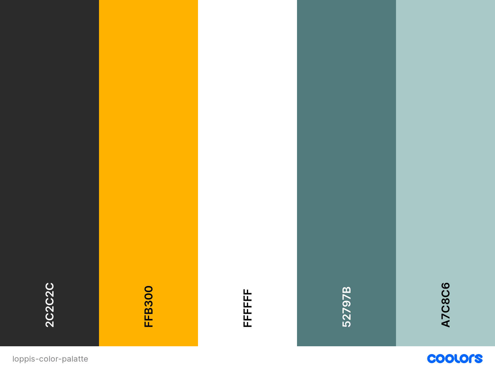

# SVERIGE LOPPIS

# Table of Contents:
* [User Experience (UX)](#ux)
    * [Strategy](#strategy)
    * [User Stories](#user-stories)
    * [Scope](#scope)
    * [Structure](#structure)
        * [Wireframes](#wireframes)
        * [Databases](#databases)
* [UI](#ui)
    * [Color Palette](#color-palette)
    * [Font](#fonts)
* [Marketing](#marketing)
    * [Plan](#plan)
        * [Facebook](#facebook)
        * [Newsletter](#newsletter)
    * [SEO's](#seos)
* [Features](#features)
    * [Navbar](#navbar)
    * [Footer](#footer)
    * [Home Page](#home-page)
    * [About Page](#about-page)
    * [Loppis Page](#loppis-page)
    * [Loppis Details Page](#lopppis-details-page)
    * [Personalized Account Page](#personalised-account-page)
    * [Wishlist Page](#loppis-wishlist-page)
    * [Purchase/Advertise Function](#purchaseadvertise-function)
    * [Asking a question to Loppis Owner Function](#asking-a-question-to-loppis-owner-function)
* [Technologies Used](#technologies-used)
* [Testing](#testing)
* [Deployment](#deployment)
* [Credits](#credits)
* [Acknowledgements](#acknowledgements)

# UX
## Strategy
## User Stories
## Scope
## Structure
### Wireframes
### Databases

# UI
## Color Palette:

* Color palette is chosen with keeping in mind the target audience. As Sverige Loppis' main target is Sweden, Blue and Yellow was my first choice.
* Blue color has a psychological effect on trust, offical, calm; and yellow color psychologically gives a charming, friendly effect.
* To maintain the color contrast I chose to use a softer tones of blue and yellow. 
* I have used [Coolors](https://coolors.co/) to generate my color palette.

## Fonts
* To maintain simple UI, font chosen was Montserrat from [Google Fonts](https://fonts.google.com/specimen/Montserrat?query=mont#standard-styles).

# Marketing
## Plan:
### Facebook
### Newsletter
## SEO's

# Features:
## Navbar
## Footer
## Home Page
## About Page
## Loppis Page
## Lopppis Details Page
## Personalised Account Page
## Loppis Wishlist Page
## Purchase/Advertise Function
## Asking a question to Loppis owner Function

# Technologies Used

# Testing

# Deployment

# Credits

## Color Palette:
* [Coolors](https://coolors.co/) to generate my color palette.
## Images:
* [Freepik](www.freepik.com):
    * [Home page background image](https://www.freepik.com/vectors/flea-market) Flea market vector created by [freepik](www.freepik.com)
    * [Default image for loppis](https://www.freepik.com/vectors/flea-market) Designed by [freepik](www.freepik.com)

## Styles:
* [CSS Scan](https://getcssscan.com/css-box-shadow-examples): Box shadow in loppis details page is from [CSS Scan](https://getcssscan.com/css-box-shadow-examples) example number 3.

## Codes:
* Grepper: “check if date < today in django template” functionality logic is by [Grepper](https://www.codegrepper.com/code-examples/python/check+if+date+%3C+today+in+django+template).
    ```python
        
        
            <h1>It's not too late!</h1>
        
    ```
* Condition date widget: 'Ensure start/end dates are not before "today", and end-date comes on/after start-date'. This logic is by Tim Nelson, mentor in Code Institute.
    ```javascript
        let now = new Date(),
        minDate = now.toISOString().substring(0,10);
        $("#id_start_date").prop("min", minDate);
        $("#id_start_date").on("change", setEndDateMin);
        $("#id_end_date").on("change", setEndDateMin);
        function setEndDateMin() {
            let startDate = $("#id_start_date").val();
            $("#id_end_date").prop("min", startDate);
        }
    ```
* Followed Code Institute's [Boutique Ado walkthrough project](https://github.com/Code-Institute-Solutions/boutique_ado_v1/tree/250e2c2b8e43cccb56b4721cd8a8bd4de6686546) steps to add stripe and adjusted according to my sites needs.
# Acknowledgements